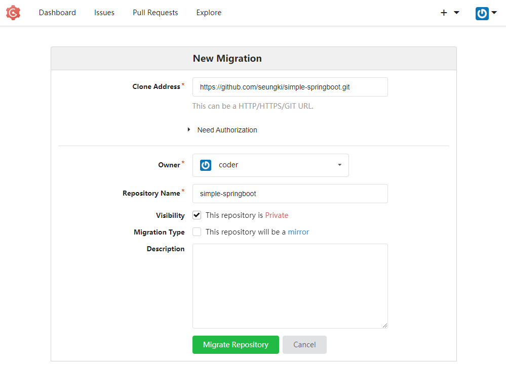
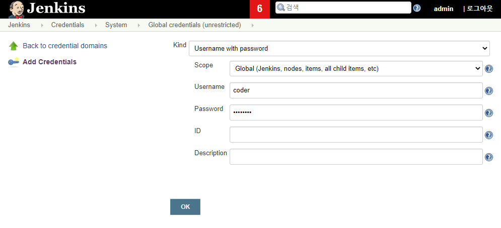
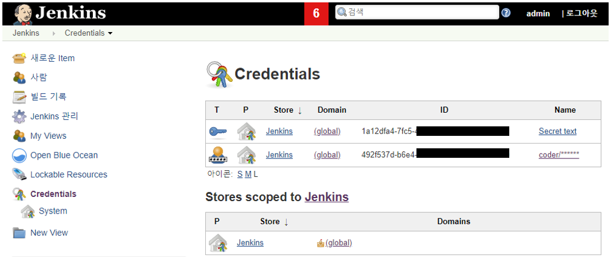
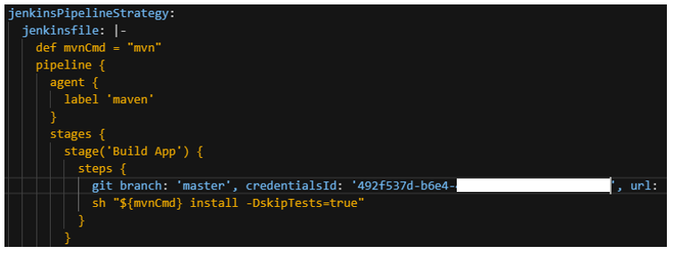
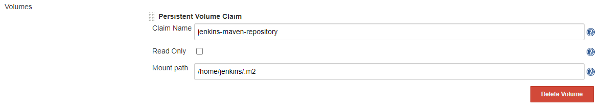
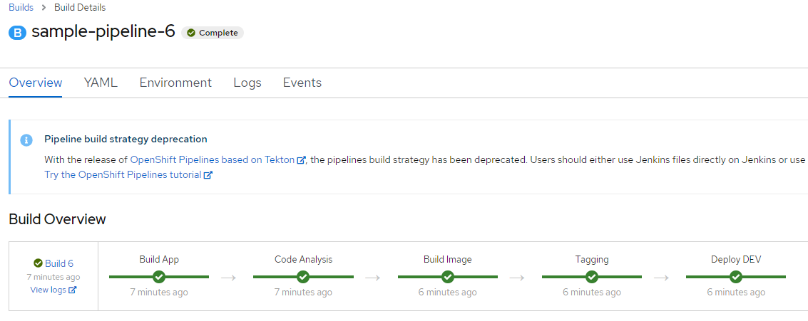

# CI/CD Persistent - OpenShift Container Platform 4.3
  ref : https://github.com/siamaksade/openshift-cd-demo/

  Install items.
  <table>
    <tbody>
    <tr>
        <td>Service</td>
        <td>Version</td>
        <td>Account</td>
    </tr>
    <tr>
        <td>Jenkins</td>
        <td>2.204.2</td>
        <td>OpenShift credentials</td> 
    </tr>
    <tr>
        <td>Gogs</td>
        <td>0.11.34</td>
        <td>gogs/gogs</td> 
    </tr>
    <tr>
        <td>Nexus</td>
        <td>3.23.0</td>
        <td>admin/admin123</td> 
    </tr>
    <tr>
        <td>Sonarqube</td>
        <td>7.1.0</td>
        <td>admin/admin</td> 
    </tr>        
    </tbody>
  </table>  
 
  
  ## 0. Prepare CI/CD template YAML file download
  ```shell
  # Clone git to your installation directory
  git clone https://github.com/seungki/ocp4-cicd-template.git
  ```

  ## 1. CI/CD Project
	
  ```shell
  # Create Project
  PROJECT_NAME=cicd-test
  oc new-project $PROJECT_NAME --display-name="CI/CD"
  oc project $PROJECT_NAME
  ```  
  <!-- # Jenkins 접근권한 부여 
  oc policy add-role-to-group edit system:serviceaccounts:$PROJECT_NAME -n $PROJECT_NAME
	
  # project 에 admin roll 부여[ocp admin 계정만 실행가능]
  oc adm policy add-role-to-user admin admin -n $PROJECT_NAME >/dev/null 2>&1
	
  # pod-network 에 project 추가[ocp admin 계정만 실행가능]
  oc adm pod-network join-projects --to=$PROJECT_NAME >/dev/null 2>&1
  -->


  ## 2. Jenkins Installation(persistent)
	
  2-1. [Manually] Jenkins PersistentVolume  (jenkins data , maven repository)
  
  ```shell
  # Create data directory.
  mkdir -m 777 -p /shared/$PROJECT_NAME/jenkins-data

  # Create maven repository directory.
  mkdir -m 777 -p /shared/$PROJECT_NAME/jenkins-maven-repository

  # Add to /etc/exports 
  /shared/$PROJECT_NAME/jenkins-data 192.168.138.0/24(rw,sync,no_wdelay,no_root_squash,insecure)
  /shared/$PROJECT_NAME/jenkins-maven-repository 192.168.138.0/24(rw,sync,no_wdelay,no_root_squash,insecure)

  # apply exports 
  exportfs -r
  ```
  2-2. Jenkins Install.
  ```shell
  # [Ref.]Install Jenkins persistent from openshift image .
  # oc new-app jenkins-persistent -n $PROJECT_NAME

  # Jenkins persistent template .
  PERSISTENT_VOLUME_IP=$(hostname -I | awk '{print $1}')
  oc new-app -f ./yaml/jenkins-persistent-template.yaml \
    --param=PROJECT_NAME=$PROJECT_NAME \
    --param=JENKINS_DATA_DIRECTORY=/shared/$PROJECT_NAME/jenkins-data \
    --param=JENKINS_MAVEN_REPO=/shared/$PROJECT_NAME/jenkins-maven-repository \
    --param=PERSISTENT_VOLUME_IP=$PERSISTENT_VOLUME_IP 
  ```
  ※ Jenkins Delete.
  ```shell
  # check list
  oc get all --selector app=jenkins
  # delete all
  oc delete all --selector app=jenkins
  # delete pv
  oc delete pv $PROJECT_NAME-jenkins-data
  oc delete pv $PROJECT_NAME-jenkins-maven-repository
  ```
	
	
  ## 3. GOGS Installation(persistent)

  3-1. [Manually] Gogs PersistentVolume (gogs data , gogs postgresql)
  - ※ gogs volume mount fail : directory owner nfsnobody:nfsnobody .
  
  ```shell
  # Create data directory.
  mkdir -m 777 -p /shared/$PROJECT_NAME/gogs-data

  # Create postgresql directory.
  mkdir -m 777 -p /shared/$PROJECT_NAME/gogs-postgres-data

  # Add to /etc/exports
  /shared/$PROJECT_NAME/gogs-data 192.168.138.0/24(rw,sync,no_wdelay,no_root_squash,insecure)
  /shared/$PROJECT_NAME/gogs-postgres-data 192.168.138.0/24(rw,sync,no_wdelay,no_root_squash,insecure)

  # exports apply
  exportfs -r	
  ```

  3-2. Gogs Install.	
  ```shell
  # Get HOSTNAME from Jenkins
  HOSTNAME=$(oc get route jenkins -o template --template='{{.spec.host}}' | sed "s/jenkins-$PROJECT_NAME.//g")
  GOGS_HOSTNAME="gogs-$PROJECT_NAME.$HOSTNAME"
  # Get IP Address
  PERSISTENT_VOLUME_IP=$(hostname -I | awk '{print $1}')
	
  # GOGS persistent template.
  oc new-app -f ./yaml/gogs-persistent-template.yaml \
    --param=PROJECT_NAME=$PROJECT_NAME \
    --param=GOGS_VERSION=0.11.34 \
    --param=SKIP_TLS_VERIFY=true \
    --param=DATABASE_VERSION=9.6 \
    --param=HOSTNAME=$GOGS_HOSTNAME \
    --param=GOGS_POSTGRESQL_DATA_DIRECTORY=/shared/$PROJECT_NAME/gogs-postgres-data \
    --param=GOGS_DATA_DIRECTORY=/shared/$PROJECT_NAME/gogs-data  \
    --param=PERSISTENT_VOLUME_IP=$PERSISTENT_VOLUME_IP 
  ```
  ※ Gogs Delete.
  ```shell
  # check list
  oc get all --selector app=gogs
  # delete all
  oc delete all --selector app=gogs
  # delete pv
  oc delete pv $PROJECT_NAME-gogs-data
  oc delete pv $PROJECT_NAME-gogs-postgres-data
  ```


  ## 4. Sonarqube Installation(persistent)
	
  4-1. [Manually] Sonarqube PersistentVolume (sonarqube data, sonarqube postgresql)
  
  ```shell
  # Create data directory.
  mkdir -m 777 -p /shared/$PROJECT_NAME/sonarqube-data

  # Create postgresql directory.
  mkdir -m 777 -p /shared/$PROJECT_NAME/sonarqube-postgres-data

  # Add to /etc/exports
  /shared/$PROJECT_NAME/sonarqube-data 192.168.138.0/24(rw,sync,no_wdelay,no_root_squash,insecure)
  /shared/$PROJECT_NAME/sonarqube-postgres-data 192.168.138.0/24(rw,sync,no_wdelay,no_root_squash,insecure)

  # exports apply
  exportfs -r	
  ```

  4-2. Sonarqube Install.	
  ```shell
  # Get IP Address
  PERSISTENT_VOLUME_IP=$(hostname -I | awk '{print $1}')
	
  # Sonarqube persistent template.
  oc new-app -f ./yaml/sonarqube-persistent-template.yaml \
    --param=PROJECT_NAME=$PROJECT_NAME \
    --param=SONARQUBE_MEMORY_LIMIT=2Gi \
    --param=SONAR_POSTGRESQL_DATA_DIRECTORY=/shared/$PROJECT_NAME/sonarqube-postgres-data \
    --param=SONAR_DATA_DIRECTORY=/shared/$PROJECT_NAME/sonarqube-data  \
    --param=PERSISTENT_VOLUME_IP=$PERSISTENT_VOLUME_IP 
  ```
  ※ Sonarqube Delete.
  ```shell
  # check list
  oc get all --selector app=sonarqube
  # delete all
  oc delete all --selector app=sonarqube
  # delete pv
  oc delete pv $PROJECT_NAME-sonarqube-data
  oc delete pv $PROJECT_NAME-sonarqube-postgres-data
  ```
	
	
  ## 5. Nexus Installation(persistent)

  5-1. [Manually] Nexus PersistentVolume (nexus data)
  
  ```shell
  # Create data directory.
  mkdir -m 777 -p /shared/$PROJECT_NAME/nexus-data

  # Add to /etc/exports 
  /shared/$PROJECT_NAME/nexus-data 192.168.138.0/24(rw,sync,no_wdelay,no_root_squash,insecure)

  # exports apply
  exportfs -r
  ```

  5-2. Nexus Install. (If password is not match, see /nexus-data/admin.password)
  ```shell
  # Get IP Address
  PERSISTENT_VOLUME_IP=$(hostname -I | awk '{print $1}')
	
  # Nexus persistent template.
  oc new-app -f ./yaml/nexus-persistent-template.yaml \
    --param=PROJECT_NAME=$PROJECT_NAME \
    --param=NEXUS_DATA_DIRECTORY=/shared/$PROJECT_NAME/nexus-data  \
    --param=PERSISTENT_VOLUME_IP=$PERSISTENT_VOLUME_IP 
  ```

  ※ Nexus Delete.
  ```shell
  # check list
  oc get all --selector app=nexus
  # delete all
  oc delete all --selector app=nexus
  # delete pv
  oc delete pv $PROJECT_NAME-nexus-data
  ```


	
  ## 6. Create Sample Application	
  6-1. Create new project for application
  ```shell
  DEV_PROJECT_NAME=test-app
  oc new-project $DEV_PROJECT_NAME --display-name="Test Application for CI/CD"
  oc project $DEV_PROJECT_NAME
  ```

  6-2. Clone simple application to GOGS
  
  
  6-3. Create Sample Application
  ```shell
  # set dev application project name
  DEV_PROJECT_NAME=test-app
  APP_NAME=simple-springboot
  # It must change HOSTNAME
  #HOSTNAME=apps.ocp4.sample.com
  APP_HOSTNAME="$APP_NAME-$DEV_PROJECT_NAME.$HOSTNAME"
	
  # create application & build & deployconfig
  oc new-app -f ./yaml/simple-springboot-template.yaml \
    --param=DEV_PROJECT_NAME=$DEV_PROJECT_NAME \
    --param=APP_NAME=$APP_NAME \
    --param=APP_HOSTNAME=$APP_HOSTNAME \
    --param=GIT_REPOSITORY_URL=https://github.com/seungki/simple-springboot.git
	
  ```
  ※ Sample Application Delete.
  ```shell
  # check list
  oc get all --selector app=$APP_NAME
  # delete all
  oc delete all --selector app=$APP_NAME
  ```
	
	
  ## 7. Set Jenkins pipeline
  
  7-1. Create Jenkins pipeline
  ```shell
  # Switch Project to ci/cd
  PROJECT_NAME=cicd-test
  oc project $PROJECT_NAME
  # set dev application project name
  DEV_PROJECT_NAME=test-app
	
  oc new-app -f ./yaml/jenkins-sample-pipeline.yaml \
    --param=DEV_PROJECT_NAME=$DEV_PROJECT_NAME \
    --param=GIT_REPOSITORY_URL=https://github.com/seungki/simple-springboot.git
  ```
  7-2. Create jenkins credential
  > Authentication failed on first build.
  >
  > - Jenkins > Credentials > Stores scoped to Jenkins > global : Add Credentials - Input gogs id/pw
  > 
  > - Inpupt gogs credentialsId to sample-pipeline buildConfig 
  > 
  > 
  
  7-3. Grant Jenkins 
  ```shell
  # Grant Jenkins Access to Projects
  PROJECT_NAME=cicd-test
  DEV_PROJECT_NAME=test-app
  oc policy add-role-to-group edit system:serviceaccounts:$PROJECT_NAME -n $DEV_PROJECT_NAME
  ``` 
  
  7-4. Jenkins Maven Repository[Optional]
  > - Jenkins > Configuration : Cloud > Kurbernetes Pod Template[name=maven] > Add Volume[PVC]
  > 
  
  ※ Jenkins pipeline Delete.
  ```shell
  # check list
  oc get all --selector app=cicd-pipeline
  # delete all
  oc delete all --selector app=cicd-pipeline
  ```


  Finally.
  > 
  